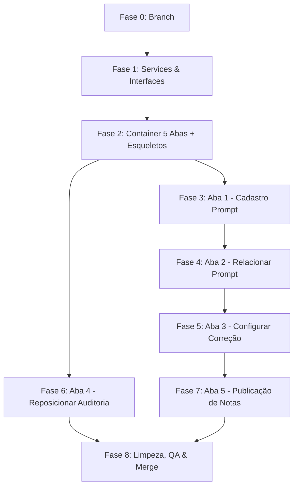

# Plano de Execução Completo — Requirements v2 (5 Abas)

> **Projeto**: vitru-angular (mesmo repositório)  
> **Branch de trabalho**: `feature/5-tabs-v2`  
> **Base de referência**: `Requirements_v2/`

---

## Fase 0 — Preparação do Ambiente

### 0.1 Criar branch de desenvolvimento
```bash
git checkout -b feature/5-tabs-v2
```

### 0.2 Verificar que a aplicação compila e roda
```bash
npm start  # deve rodar em localhost:4200 sem erros
```

**Critério de aceite**: Branch criado, app rodando, nenhum erro no console.

---

## Fase 1 — Camada de Dados (Services & Interfaces)

Criar toda a infraestrutura de dados **antes** da UI. Isso garante que os componentes já terão dados mock disponíveis desde o primeiro render.

### 1.1 Definir Interfaces (Types)

**Arquivo**: `src/app/features/ia-corrections/models/ia-corrections.models.ts` (NOVO)

```typescript
export interface Prompt {
  id: string;
  title: string;
  body: string;              // até 10.000 caracteres
  businessUnitId: number;
  businessUnitName: string;
  activityTypeId: number;
  activityTypeName: string;
  createdAt: string;
  createdBy: string;
}

export interface PromptLink {
  id: string;
  promptId: string;
  promptTitle: string;
  courseId: number;
  courseName: string;
  clusterId: number;
  clusterName: string;
  activityTypeName: string;
}

export interface CorrectionConfig {
  id: string;
  businessUnitName: string;
  clusterName: string;
  courseName: string;
  activityTypeName: string;
  promptTitle: string;
  correctionStatus: 'Ativo' | 'Inativo';   // default: Inativo
}

export interface PublicationConfig {
  id: string;
  businessUnitName: string;
  clusterName: string;
  courseName: string;
  activityTypeName: string;
  promptTitle: string;
  correctionStatus: 'Ativo' | 'Inativo';    // herdado de CorrectionConfig
  publicationStatus: 'Habilitado' | 'Desabilitado';  // default: Desabilitado
  performanceThreshold: number | null;       // % de corte (RN25-RN27)
}

// Manter a interface AuditLog existente (sem alterações)
```

### 1.2 Criar `PromptService`

**Arquivo**: `src/app/features/ia-corrections/services/prompt.service.ts` (NOVO)

| Método | Descrição | US |
|---|---|---|
| `getPrompts()` | Retorna lista de todos os prompts | US01, US02 |
| `getPromptById(id)` | Retorna prompt específico para edição | US02 |
| `createPrompt(payload)` | Cria novo prompt (título, corpo, unidade, atividade) | US01 |
| `updatePrompt(id, payload)` | Edita prompt existente | US02 |

**Mock data**: 3–5 prompts pré-cadastrados com textos reais de correção.

### 1.3 Criar `PromptLinkingService`

**Arquivo**: `src/app/features/ia-corrections/services/prompt-linking.service.ts` (NOVO)

| Método | Descrição | US |
|---|---|---|
| `getCoursesByUnit(unitId)` | Retorna cursos agrupados por cluster | US04 |
| `getLinksByPrompt(promptId)` | Retorna vínculos existentes de um prompt | US04 |
| `linkPromptToCourse(promptId, courseId)` | Cria vínculo (valida unicidade) | US04, US05 |
| `unlinkPromptFromCourse(promptId, courseId)` | Remove vínculo | US06 |
| `updateCoursePrompt(courseId, oldPromptId, newPromptId)` | Substitui prompt vinculado | US06 |

**Mock data**: 10–15 cursos distribuídos em 3 clusters, com alguns vínculos pré-existentes.

### 1.4 Criar `CorrectionConfigService`

**Arquivo**: `src/app/features/ia-corrections/services/correction-config.service.ts` (NOVO)

| Método | Descrição | US |
|---|---|---|
| `getConfigs()` | Lista todas as combinações Unidade > Cluster > Curso > Atividade > Prompt | US08 |
| `updateStatus(id, status)` | Altera status de correção individual | US09 |
| `updateStatuses(ids[], status)` | Altera status em lote | US10 |

**Mock data**: Gerado a partir dos vínculos do PromptLinkingService, todos começando como `Inativo`.

### 1.5 Criar `PublicationService`

**Arquivo**: `src/app/features/ia-corrections/services/publication.service.ts` (NOVO)

| Método | Descrição | US |
|---|---|---|
| `getPublicationConfigs()` | Lista registros com status de publicação | US13 |
| `updatePublicationStatus(id, status)` | Altera status (valida dependência com correção) | US14 |
| `updatePublicationStatuses(ids[], status)` | Altera em lote | US13 |
| `setPerformanceThreshold(id, percentage)` | Define % de corte | US15 |

**Regra crítica (RN24)**: Se `correctionStatus === 'Inativo'`, o toggle de publicação deve ser bloqueado.

**Critério de aceite da Fase 1**: Todos os services criados com mock data, compilando sem erros.

---

## Fase 2 — Refatorar Container Principal (5 Abas)

### 2.1 Atualizar `IaCorrectionsPageComponent`

**Arquivo**: `src/app/features/ia-corrections/ia-corrections-page.component.ts`  
**Arquivo**: `src/app/features/ia-corrections/ia-corrections-page.component.html`

**Ações**:
- Alterar o sistema de abas de 2 para 5 abas.
- Ordem: Cadastro Prompt → Relacionar Prompt → Configurar Correção → Auditoria Correções → Publicação de Notas.
- A antiga aba "Parametrizar Atividade" será **removida** (seu conteúdo se distribui nas abas 1, 2, 3 e 5).
- A aba "Auditoria de Configurações" será **mantida** e reposicionada como aba 4.
- Importar os 4 novos componentes (serão criados nas fases seguintes com template placeholder).

### 2.2 Criar esqueletos dos 4 novos componentes

Criar arquivos `.ts`, `.html`, `.css` com conteúdo placeholder para cada:

| Componente | Diretório |
|---|---|
| `PromptRegistrationTabComponent` | `components/prompt-registration-tab/` |
| `PromptLinkingTabComponent` | `components/prompt-linking-tab/` |
| `CorrectionConfigTabComponent` | `components/correction-config-tab/` |
| `PublicationTabComponent` | `components/publication-tab/` |

Cada esqueleto terá apenas:
```html
<div class="card param-container">
  <h5>Nome da Aba — Em construção</h5>
</div>
```

**Critério de aceite da Fase 2**: App rodando com 5 abas visíveis e navegáveis. Aba 4 (Auditoria) funcional. Demais abas mostram placeholder.

---

## Fase 3 — Aba 1: Cadastro Prompt (US01, US02, US03)

### 3.1 Layout split-panel

**Arquivo**: `components/prompt-registration-tab/prompt-registration-tab.component.html`

```
┌─────────────────────────────┬───────────────────────────────────────┐
│  LISTA DE PROMPTS           │  EDITOR DE PROMPT                    │
│                             │                                       │
│  [+ Criar Novo Prompt]      │  Título: [__________________]        │
│                             │  Unid. Negócio: [dropdown____]       │
│  ● Prompt Corretor v1      │  Tipo Atividade: [dropdown___]       │
│  ● Prompt Resenha v2       │                                       │
│  ● Prompt MAPA padrão      │  Corpo do Prompt:                    │
│                             │  ┌──────────────────────────────┐    │
│                             │  │                              │    │
│                             │  │  (textarea 10.000 chars)     │    │
│                             │  │                              │    │
│                             │  └──────────────────────────────┘    │
│                             │                                       │
│                             │              [Salvar]                 │
└─────────────────────────────┴───────────────────────────────────────┘
```

### 3.2 Lógica do componente

**Arquivo**: `components/prompt-registration-tab/prompt-registration-tab.component.ts`

- **Signals**: `prompts`, `selectedPrompt`, `isEditing`, `formDirty`
- **Métodos**: `createNew()`, `selectPrompt(id)`, `save()`, `checkUnsavedChanges()`
- **Injetar**: `PromptService`

### 3.3 Guard de navegação (unsaved changes)

**Arquivo**: `src/app/features/ia-corrections/guards/unsaved-changes.guard.ts` (NOVO)

- Intercepta mudança de aba quando `formDirty === true`.
- Exibe `confirm()` com opções "Salvar" / "Descartar" / "Cancelar".
- Integrar com o container principal via `@Output()` ou callback de aba.

**Critério de aceite da Fase 3**: Criar novo prompt, editar existente, salvar alterações, confirmação ao tentar sair com alterações pendentes.

---

## Fase 4 — Aba 2: Relacionar Prompt (US04, US05, US06, US07)

### 4.1 Layout

```
┌──────────────────────────────────────────────────────────────────┐
│  Prompt selecionado: [dropdown de prompts_________▼]             │
│  (Unidade: Uniasselvi | Atividade: Desafio Profissional)        │
├──────────────────────────────────────────────────────────────────┤
│  Filtro Cluster: [___] Filtro Curso: [___]                       │
├──────┬─────────────┬──────────────────┬──────────────┬──────────┤
│  ☐   │ Cluster     │ Curso            │ Prompt Vinc. │ Ações    │
├──────┼─────────────┼──────────────────┼──────────────┼──────────┤
│  ☐   │ Cluster Sul │ Eng. Software    │ Prompt v1    │ ✏️ 🗑️    │
│  ☐   │ Cluster Sul │ Administração    │ —            │ ➕       │
│  ☐   │ Cluster N.  │ Pedagogia        │ —            │ ➕       │
│  ...                                  (paginação: 100/página)    │
└──────────────────────────────────────────────────────────────────┘
```

### 4.2 Lógica do componente

**Arquivo**: `components/prompt-linking-tab/prompt-linking-tab.component.ts`

- **Signals**: `selectedPromptId`, `courses`, `links`, `filters`
- **Métodos**: `linkPrompt(courseId)`, `unlinkPrompt(courseId)`, `updateLink(courseId, newPromptId)`
- **Validação (RN07)**: Antes de vincular, verificar se o curso já tem prompt para o mesmo tipo de atividade.
- **Paginação**: 100 registros por página (conforme definido).
- **Injetar**: `PromptService`, `PromptLinkingService`

**Critério de aceite da Fase 4**: Vincular prompt a curso, trocar prompt vinculado, remover vínculo, bloqueio de duplicidade (Curso + Atividade).

---

## Fase 5 — Aba 3: Configurar Correção (US08, US09, US10, US11)

### 5.1 Layout

```
┌──────────────────────────────────────────────────────────────────┐
│  Configurações de Correção por IA           [Alterar Status]     │
├──────┬─────────┬──────────┬─────────┬───────────┬───────┬───────┤
│  ☐   │ Status  │ Unidade  │ Cluster │ Curso     │ Ativ. │Prompt │
│      │         │ Pesq..   │ Pesq..  │ Pesq..    │Pesq.. │Pesq.. │
├──────┼─────────┼──────────┼─────────┼───────────┼───────┼───────┤
│  ☐   │ Inativo │ Uniass.  │ Cl. Sul │ Eng. Sof. │ Desaf.│Prom.1 │
│  ☐   │ Ativo   │ Uniass.  │ Cl. N.  │ Adm.      │ Prova │Prom.2 │
└──────────────────────────────────────────────────────────────────┘
```

### 5.2 Lógica do componente

**Arquivo**: `components/correction-config-tab/correction-config-tab.component.ts`

- **Baseado no padrão do AuditTabComponent existente** (filtros por coluna, checkboxes, paginação, botão "Alterar Status").
- **Signals**: `configs`, `columnFilters`, `selectedIds`, `itemsPerPage` (25 default)
- **Injetar**: `CorrectionConfigService`
- **Diferença vs Auditoria**: Status default Inativo (RN13), toggle individual por linha (RN15).

**Critério de aceite da Fase 5**: Listar combinações, ativar/inativar individual, ativar/inativar em lote, filtrar por todas as colunas.

---

## Fase 6 — Reposicionar Aba 4: Auditoria (US12)

### 6.1 Ajuste mínimo

- **Nenhuma alteração funcional** no `AuditTabComponent`.
- Apenas garantir que ele aparece na posição 4 no container principal.
- Verificar que importações e bindings estão corretos após a refatoração da Fase 2.

**Critério de aceite da Fase 6**: Auditoria funcional na posição 4, sem regressões.

---

## Fase 7 — Aba 5: Publicação de Notas (US13, US14, US15)

### 7.1 Layout

```
┌──────────────────────────────────────────────────────────────────┐
│  Regras de Publicação Automática                                 │
│  ┌────────────────────────────────────────────────────────────┐  │
│  │ 📊 Desempenho mínimo para publicação: [___]%              │  │
│  │ ✅ Notas ≥ valor → publicadas automaticamente             │  │
│  │ ⏸️  Notas < valor → retidas para curadoria manual          │  │
│  │ 🔄 O percentual pode ser ajustado a qualquer momento      │  │
│  └────────────────────────────────────────────────────────────┘  │
├──────────────────────────────────────────────────────────────────┤
│                                                 [Alterar Status] │
├──────┬──────────┬──────────┬─────────┬───────┬───────┬──────────┤
│  ☐   │ Status   │ Unidade  │ Cluster │ Curso │ Ativ. │ Prompt   │
├──────┼──────────┼──────────┼─────────┼───────┼───────┼──────────┤
│  ☐   │ Desab.   │ Uniass.  │ Cl. Sul │ E.S.  │ Des.  │ Prom. 1  │
│  🔒  │ [lock]   │ Uniass.  │ Cl. N.  │ Adm.  │ Prova │ Prom. 2  │
│      │ (correção inativa → publicação bloqueada)                 │
└──────────────────────────────────────────────────────────────────┘
```

### 7.2 Lógica do componente

**Arquivo**: `components/publication-tab/publication-tab.component.ts`

- **Estrutura idêntica ao AuditTab** (copiar padrão de filtros, paginação, seleção em lote).
- **Regra crítica (RN24)**: Linhas com `correctionStatus === 'Inativo'` devem exibir ícone de 🔒 e ter checkbox/toggle desabilitados.
- **Painel superior**: Card com regras RN25, RN26, RN27 e input de percentual.
- **Injetar**: `PublicationService`, `CorrectionConfigService` (para verificar dependência)

**Critério de aceite da Fase 7**: Habilitar/desabilitar publicação, bloqueio quando correção inativa, configurar % de corte, ações em lote.

---

## Fase 8 — Limpeza, QA e Merge

### 8.1 Remover código obsoleto
- Remover `ParameterizationTabComponent` (aba antiga "Parametrizar Atividade").
- Remover referências no container principal.
- Limpar imports não utilizados.

### 8.2 Testes manuais via browser (QA)

| Fluxo | Validação |
|---|---|
| Aba 1 → Criar prompt | Título, corpo (10k chars), unidade, atividade → Salvar → Aparece na lista |
| Aba 1 → Editar prompt | Selecionar da lista → Alterar → Salvar → Dados atualizados |
| Aba 1 → Guard de navegação | Alterar campo → Trocar aba → Confirmação aparece |
| Aba 2 → Vincular prompt | Selecionar prompt → Vincular a curso → Vínculo aparece |
| Aba 2 → Unicidade | Tentar vincular 2 prompts ao mesmo curso+atividade → Bloqueio |
| Aba 2 → Remover vínculo | Remover → Curso volta a mostrar "—" |
| Aba 3 → Ativar correção | Toggle individual → Status muda para Ativo |
| Aba 3 → Ação em lote | Selecionar vários → "Alterar Status" → Todos mudam |
| Aba 3 → Filtros | Filtrar por cada coluna → Resultados corretos |
| Aba 4 → Auditoria | Verificar que continua funcionando sem regressão |
| Aba 5 → Publicação | Habilitar publicação → Campo % aparece |
| Aba 5 → Dependência | Correção Inativa → Toggle publicação bloqueado (🔒) |
| Aba 5 → Lote | Selecionar vários → "Alterar Status" → Respeita dependência |

### 8.3 Commit e merge
```bash
git add .
git commit -m "feat: implement 5-tab architecture (Requirements v2)"
git checkout master
git merge feature/5-tabs-v2
git push origin master
```

---

## Resumo de Arquivos

### Novos (a criar)
| Arquivo | Fase |
|---|---|
| `models/ia-corrections.models.ts` | 1 |
| `services/prompt.service.ts` | 1 |
| `services/prompt-linking.service.ts` | 1 |
| `services/correction-config.service.ts` | 1 |
| `services/publication.service.ts` | 1 |
| `components/prompt-registration-tab/*` | 3 |
| `components/prompt-linking-tab/*` | 4 |
| `components/correction-config-tab/*` | 5 |
| `components/publication-tab/*` | 7 |
| `guards/unsaved-changes.guard.ts` | 3 |

### Modificados
| Arquivo | Fase |
|---|---|
| `ia-corrections-page.component.ts` | 2 |
| `ia-corrections-page.component.html` | 2 |

### Removidos
| Arquivo | Fase |
|---|---|
| `components/parameterization-tab/*` | 8 |

### Mantidos (sem alteração)
| Arquivo | Fase |
|---|---|
| `components/audit-tab/*` | 6 |
| `services/ia-config.service.ts` (para Auditoria) | — |

---

## Ordem de Execução Recomendada



> **Nota**: Fases 3 e 6 podem rodar em paralelo. Fase 4 depende da 3 (precisa de prompts cadastrados). Fase 5 depende da 4 (precisa de vínculos). Fase 7 depende da 5 (precisa de status de correção).
