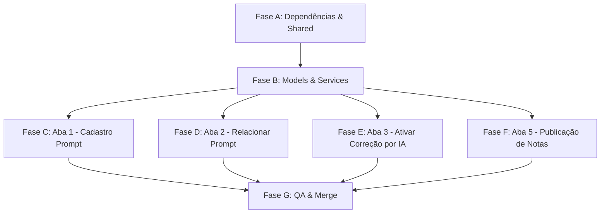

# Plano de Execução v4 — Implementação das Mudanças

> **Projeto**: vitru-angular (mesmo repositório)
> **Branch de trabalho**: `feature/v4-discipline-hierarchy`
> **Base**: código atual em `master` (v3 concluída — hash `9c32e25`)
> **Referência**: `Requirements_v2/` (Business_Rules_v2, User_Stories_v2, Tech_Spec_Implementation_v2)
> **Importante**: Este plano é destinado a outro agente que fará a implementação. Não altere a estrutura de pastas nem o padrão de componentes existentes.

---

## Pré-requisitos

Antes de iniciar, o agente executor deve:

1. Criar a branch: `git checkout -b feature/v4-discipline-hierarchy`
2. Instalar a dependência de Sweet Alerts: `npm install sweetalert2`
3. Verificar que o servidor compila sem erros: `npm start`
4. Ler todos os documentos em `Requirements_v2/` para compreender o contexto completo.

---

## Fase A — Dependências, Serviço de Sweet Alerts e Componentes Compartilhados

### A.1 Instalar `sweetalert2`

```bash
npm install sweetalert2
```

### A.2 Criar `SweetAlertService`

**Arquivo**: `services/sweet-alert.service.ts`

Criar um serviço Angular injectable centralizado para sweet alerts:

```typescript
import { Injectable } from '@angular/core';
import Swal from 'sweetalert2';

@Injectable({ providedIn: 'root' })
export class SweetAlertService {

  showLoading(message: string = 'Processando...'): void {
    Swal.fire({
      title: message,
      text: 'Aguarde enquanto os dados são processados.',
      allowOutsideClick: false,
      allowEscapeKey: false,
      didOpen: () => Swal.showLoading()
    });
  }

  closeLoading(): void {
    Swal.close();
  }

  async confirmAction(title: string, message: string): Promise<boolean> {
    const result = await Swal.fire({
      title,
      text: message,
      icon: 'question',
      showCancelButton: true,
      confirmButtonColor: '#405189',
      cancelButtonColor: '#f06548',
      confirmButtonText: 'Confirmar',
      cancelButtonText: 'Cancelar'
    });
    return result.isConfirmed;
  }

  showSuccess(title: string, message: string): void {
    Swal.fire({ title, text: message, icon: 'success', confirmButtonColor: '#405189' });
  }

  showError(title: string, message: string): void {
    Swal.fire({ title, text: message, icon: 'error', confirmButtonColor: '#405189' });
  }
}
```

### A.3 Atualizar `PromptDetailModalComponent`

**Arquivo**: `components/shared/prompt-detail-modal/`

O modal precisa exibir **dois campos readonly** para o corpo do prompt:

1. Substituir o campo único `Corpo do Prompt` por dois campos:
   - **"Prompt Avaliação"** — textarea readonly, background `#f0f0f0`
   - **"Prompt Feedback"** — textarea readonly, background `#f0f0f0`
2. O input do componente agora recebe `prompt.bodyEvaluation` e `prompt.bodyFeedback` (ao invés de `prompt.body`).
3. Manter o campo Observações editável + botão "Salvar Comentário".

**Critério de aceite**: Modal compila, exibe os dois campos de corpo em readonly, observações salva independentemente.

---

## Fase B — Atualizar Modelos & Services

### B.1 Atualizar `ia-corrections.models.ts`

**Arquivo**: `models/ia-corrections.models.ts`

#### B.1.1 Interface `Prompt`
Substituir o campo `body: string` por:
```typescript
bodyEvaluation: string;  // até 10.000 caracteres (Prompt de Avaliação)
bodyFeedback: string;     // até 10.000 caracteres (Prompt de Feedback)
```

#### B.1.2 Nova interface `Discipline`
```typescript
export interface Discipline {
  id: number;
  name: string;
  courseId: number;
  courseName: string;
  clusterId: number;
  clusterName: string;
  businessUnitId: number;
}
```

#### B.1.3 Interface `PromptLink`
Adicionar campos de disciplina (manter campos de curso para contexto):
```typescript
export interface PromptLink {
  id: string;
  promptId: string;
  promptTitle: string;
  disciplineId: number;     // NOVO — principal entidade de vínculo
  disciplineName: string;   // NOVO
  courseId: number;          // mantido para contexto na tabela
  courseName: string;       // mantido para contexto na tabela
  clusterId: number;
  clusterName: string;
  activityTypeName: string;
}
```

#### B.1.4 Interface `CorrectionConfig`
Adicionar campos:
```typescript
disciplineName: string;   // NOVO
createdAt: string;        // NOVO — para exportação
createdBy: string;        // NOVO — para exportação
updatedAt: string;        // NOVO — para exportação
updatedBy: string;        // NOVO — para exportação
```

#### B.1.5 Interface `PublicationConfig`
Adicionar campo:
```typescript
disciplineName: string;   // NOVO
```

### B.2 Atualizar `prompt.service.ts`

**Alterações**:
1. Atualizar **todos os prompts do mock** para usar `bodyEvaluation` e `bodyFeedback` ao invés de `body`.
2. Atualizar `createPrompt()` e `updatePrompt()` para aceitar os novos campos.
3. Manter `getPrompts()`, `getPromptById()`, `updatePromptStatus()`, `updatePromptObservations()` etc. sem mudanças de API (apenas os dados internos mudam).

**Dados mock de referência** (substitua os existentes):
```typescript
{
  id: 'PRM-001',
  title: 'Prompt Corretor Padrão',
  bodyEvaluation: 'Avalie a submissão do aluno considerando os critérios...',
  bodyFeedback: 'Forneça feedback construtivo ao aluno sobre...',
  businessUnitId: 1,
  businessUnitName: 'Uniasselvi',
  activityTypeId: 1,
  activityTypeName: 'Desafio Profissional',
  createdAt: '2026-01-15 10:30',
  createdBy: 'USR-Admin',
  status: 'Ativo',
  observations: ''
}
```

### B.3 Atualizar `prompt-linking.service.ts`

**Alterações maiores — migração de Curso para Disciplina**:

1. **Adicionar array de disciplinas** ao serviço (pelo menos 5 por curso, conforme user request):

```typescript
private disciplines: Discipline[] = [
  // Engenharia de Software (courseId: 101)
  { id: 1001, name: 'Algoritmos', courseId: 101, courseName: 'Engenharia de Software', clusterId: 1, clusterName: 'Cluster Sul', businessUnitId: 1 },
  { id: 1002, name: 'Banco de Dados', courseId: 101, courseName: 'Engenharia de Software', clusterId: 1, clusterName: 'Cluster Sul', businessUnitId: 1 },
  { id: 1003, name: 'Engenharia de Requisitos', courseId: 101, courseName: 'Engenharia de Software', clusterId: 1, clusterName: 'Cluster Sul', businessUnitId: 1 },
  { id: 1004, name: 'Arquitetura de Software', courseId: 101, courseName: 'Engenharia de Software', clusterId: 1, clusterName: 'Cluster Sul', businessUnitId: 1 },
  { id: 1005, name: 'Testes de Software', courseId: 101, courseName: 'Engenharia de Software', clusterId: 1, clusterName: 'Cluster Sul', businessUnitId: 1 },
  // Administração (courseId: 102)
  { id: 1006, name: 'Gestão de Projetos', courseId: 102, courseName: 'Administração', clusterId: 1, clusterName: 'Cluster Sul', businessUnitId: 1 },
  { id: 1007, name: 'Marketing', courseId: 102, courseName: 'Administração', clusterId: 1, clusterName: 'Cluster Sul', businessUnitId: 1 },
  { id: 1008, name: 'Contabilidade Gerencial', courseId: 102, courseName: 'Administração', clusterId: 1, clusterName: 'Cluster Sul', businessUnitId: 1 },
  { id: 1009, name: 'Recursos Humanos', courseId: 102, courseName: 'Administração', clusterId: 1, clusterName: 'Cluster Sul', businessUnitId: 1 },
  { id: 1010, name: 'Logística', courseId: 102, courseName: 'Administração', clusterId: 1, clusterName: 'Cluster Sul', businessUnitId: 1 },
  // ... (mínimo de 5 disciplinas por curso. Gerar para TODOS os cursos existentes no mock de courses)
];
```

2. **Novos métodos**:
   - `getAllDisciplines(): Observable<Discipline[]>`
   - `getDisciplinesByFilters(unitIds?, clusterIds?, courseIds?): Observable<Discipline[]>` — retorna disciplinas filtradas pela hierarquia.
   - `linkPromptToDisciplines(promptId, promptTitle, disciplineIds[], activityTypeName): Observable<{created: PromptLink[], skipped: number}>` — vinculação em massa com validação de existente (retorna quantos foram criados e quantos ignorados por já possuir o mesmo prompt).

3. **Atualizar links existentes** no mock para usar `disciplineId`/`disciplineName`.

4. **Atualizar validação de unicidade** (RN07): de `(Course + Atividade)` para `(Discipline + Atividade)`.

### B.4 Atualizar `correction-config.service.ts`

**Alterações**:
1. Adicionar `disciplineName` a todos os registros do mock.
2. Adicionar campos de auditoria (`createdAt`, `createdBy`, `updatedAt`, `updatedBy`) a todos os registros.
3. Novo método: `exportConfigs(): Observable<CorrectionConfig[]>` — retorna todos os configs para exportação.
4. Atualizar `updateStatus()` para gravar `updatedAt` e `updatedBy`.

### B.5 Atualizar `publication.service.ts`

**Alterações**:
1. Adicionar `disciplineName` a todos os registros do mock `PublicationConfig`.
2. Manter demais métodos sem alteração.

**Critério de aceite**: Todos os services compilam, novos métodos retornam dados, mock data atualizado com disciplinas, todos os modelos refletem os novos campos.

---

## Fase C — Aba 1: Cadastro Prompt (Alterações Visuais e Funcionais)

### C.1 Dois Campos de Corpo do Prompt

**Arquivo**: `components/prompt-registration-tab/prompt-registration-tab.component.html`

Substituir o textarea único "Corpo do Prompt" por dois textareas em sequência:

```
┌──────────────────────────────────────────┐
│  Prompt Avaliação                       │
│  ┌──────────────────────────────────────┐│
│  │  textarea (10.000 chars)             ││
│  └──────────────────────────────────────┘│
│  X / 10.000 caracteres                   │
│                                          │
│  Prompt Feedback                         │
│  ┌──────────────────────────────────────┐│
│  │  textarea (10.000 chars)             ││
│  └──────────────────────────────────────┘│
│  X / 10.000 caracteres                   │
└──────────────────────────────────────────┘
```

**Arquivo**: `components/prompt-registration-tab/prompt-registration-tab.component.ts`

Atualizar `formData` para incluir `bodyEvaluation` e `bodyFeedback` ao invés de `body`. Atualizar `checkFormDirty()`, `save()`, `selectPrompt()`, `resetForm()` e `isFormValid()` para usar os novos campos.

### C.2 Dropdown de Situação (Mover para linha dos dropdowns)

**Mudança visual**: Transformar o badge de Ativo/Inativo em um **dropdown `<select>`** no padrão visual dos demais dropdowns.

**Posição**: Na mesma **linha** dos dropdowns de Unidade e Atividade. A linha passa de 2 colunas (`col-md-6 col-md-6`) para **3 colunas** (`col-md-4 col-md-4 col-md-4`):

```
┌────────────────┬────────────────┬────────────────┐
│ Unidade de     │ Tipo de        │ Situação       │
│ Negócio [▼]    │ Atividade [▼]  │ [Ativo ▼]      │
└────────────────┴────────────────┴────────────────┘
```

**Remover**: O badge/toggle clicável de status do header do editor (não é mais necessário, pois o dropdown já cumpre essa função). O badge pode ser mantido como informação visual na lista, mas a edição se dá pelo dropdown.

### C.3 Contorno nos Cards de Prompt (Lista)

**Arquivo**: `components/prompt-registration-tab/prompt-registration-tab.component.css`

Adicionar borda visível a cada `.prompt-item`:

```css
.prompt-item {
  border: 1px solid #ced4da;
  border-radius: 4px;
  margin-bottom: 6px;
  padding: 10px 12px;
  cursor: pointer;
  transition: border-color 0.2s, background-color 0.2s;
}

.prompt-item:hover {
  border-color: #405189;
  background-color: #f8f9fa;
}

.prompt-item.active {
  border-color: #405189;
  border-left: 3px solid #405189;
  background-color: #eef1f7;
}
```

### C.4 Badge de "Ativo" mais Legível

Alterar o estilo do badge "Ativo" nos cards da lista de prompts para garantir legibilidade:

```css
.prompt-item .badge-success {
  background-color: #0ab39c;
  color: #ffffff;
  font-weight: 600;
  padding: 3px 8px;
  font-size: 0.75rem;
}

.prompt-item .badge-secondary {
  background-color: #878a99;
  color: #ffffff;
  font-weight: 600;
  padding: 3px 8px;
  font-size: 0.75rem;
}
```

> **Nota**: Se o verde `#0ab39c` escuro com fonte branca ainda parecer pouco legível, considere usar `background-color: #e9f8f5; color: #0ab39c; border: 1px solid #0ab39c;` como alternativa ("outlined badge").

**Critério de aceite**: Dois textareas funcionam e salvam independentemente, dropdown de Situação funciona na mesma linha dos demais, cards possuem contorno visível, badge de Ativo é facilmente legível.

---

## Fase D — Aba 2: Relacionar Prompt (Hierarquia com Disciplina)

### D.1 Adicionar filtros Cluster, Curso e Disciplina

**Arquivo**: `components/prompt-linking-tab/prompt-linking-tab.component.ts`

Adicionar signals para os novos filtros:
```typescript
selectedClusters = signal<number[]>([]);
selectedCourses = signal<number[]>([]);
selectedDisciplines = signal<number[]>([]);
```

A hierarquia de cascata dos filtros deve seguir:
```
Unidade → Cluster → Curso → Disciplina → Tipo de Atividade
```

Cada filtro abaixo deve ter suas opções recalculadas via `computed()` baseado na seleção do filtro acima.

### D.2 Botão Pesquisar

Adicionar um botão "Pesquisar" ao lado dos filtros. Os filtros **NÃO** aplicam filtragem imediatamente na tabela. A tabela só é atualizada ao clicar no botão.

**Lógica**:
```typescript
onSearch() {
  this.sweetAlertService.showLoading('Buscando registros...');
  // Simular chamada ao backend com delay
  this.linkingService.getDisciplinesByFilters(
    this.selectedUnits(), this.selectedClusters(), this.selectedCourses()
  ).subscribe(disciplines => {
    // Filtrar e popular tabela
    this.sweetAlertService.closeLoading();
  });
}
```

### D.3 Coluna Disciplina na Tabela

Adicionar coluna **Disciplina** na tabela, entre Curso e Prompt Vinculado:

| # | Coluna | Nota |
|---|---|---|
| 1 | ☐ Checkbox | Seleção para vinculação em massa |
| 2 | Unidade de Negócio | Texto |
| 3 | Tipo de Atividade | Texto |
| 4 | Cluster | Texto |
| 5 | Curso | Texto |
| 6 | **Disciplina** | **NOVO** — Texto |
| 7 | Prompt Vinculado | **Clicável** → abre modal |

### D.4 Lógica Inteligente de Vinculação em Massa

O botão "Vincular Prompt em Massa" deve:

1. **Exibir contagem dinâmica**:
   - Se há checkboxes marcados: `"Vincular Prompt em Massa (X selecionados)"`
   - Se não há: `"Vincular Prompt em Massa (Y filtrados)"`

2. **Ao clicar**:
   ```typescript
   async onBulkLink() {
     // Atenção: filteredRecords deve conter TODOS os registros
     // filtrados na base, e não apenas os da página atual.
     const targets = this.selectedIds().length > 0
       ? this.selectedIds()
       : this.filteredRecords().map(r => r.id);

     const confirmed = await this.sweetAlertService.confirmAction(
       'Confirmar Vinculação',
       `Deseja vincular o prompt "${this.selectedPromptTitle()}" a ${targets.length} registro(s)?`
     );
     if (!confirmed) return;

     this.sweetAlertService.showLoading('Vinculando...');
     this.linkingService.linkPromptToDisciplines(/*...*/).subscribe(result => {
       this.sweetAlertService.closeLoading();
       this.sweetAlertService.showSuccess(
         'Concluído!',
         `${result.created.length} registros vinculados.
          ${result.skipped} registros já possuíam este prompt.`
       );
       this.loadData(); // Recarregar lista
     });
   }
   ```

3. **Validação de vínculo existente** (RN09.1.1): O service `linkPromptToDisciplines` deve validar internamente se o registro já possui o mesmo prompt. Se sim, **não atualiza** mas contabiliza como "skipped" no retorno.

### D.5 Manter Modal e Paginação

- Modal de detalhe do prompt (usando `PromptDetailModalComponent` atualizado).
- Paginação padrão Auditoria (sem alterações).

**Critério de aceite**: Filtros em cascata com 5 níveis, botão pesquisar com sweet alert de loading, coluna Disciplina na tabela, vinculação em massa inteligente com sweet alerts de confirmação e conclusão, validação de vínculo existente.

---

## Fase E — Aba 3: Ativar Correção por IA

### E.1 Renomear aba

**Arquivo**: `ia-corrections-page.component.html`

Alterar o texto da terceira aba de `"Configurar Correção"` para `"Ativar Correção por IA"`.

### E.2 Botão Pesquisar nos Filtros

Mesmo comportamento da Aba 2 (D.2): botão "Pesquisar" ao lado dos filtros, sweet alert de loading.

### E.3 Coluna Disciplina na Tabela

Adicionar coluna **Disciplina** na tabela, entre Curso e Tipo de Atividade:

| # | Coluna |
|---|---|
| 1 | ☐ Checkbox |
| 2 | Status (badge clicável) |
| 3 | Unidade |
| 4 | Cluster |
| 5 | Curso |
| 6 | **Disciplina** |
| 7 | Tipo de Atividade |
| 8 | Prompt (clicável → modal) |

### E.4 Botão "Ativar em Massa" (Substituir "Alterar Status")

1. **Renomear** o botão de "Alterar Status" para **"Ativar em Massa"**.
2. **Fixar** o botão na tela (posição fixa, mesmo padrão do "Vincular Prompt em Massa" da Aba 2).
3. **Contagem dinâmica** no texto do botão.
4. **Lógica inteligente**:
   ```typescript
   async onBulkActivate() {
     // Atenção: filteredConfigs deve conter TODOS os registros
     // filtrados na base, e não apenas os da página atual.
     const targets = this.selectedIds().length > 0
       ? this.getSelectedConfigs()
       : this.filteredConfigs();

     const hasInactive = targets.some(t => t.correctionStatus === 'Inativo');
     const newStatus = hasInactive ? 'Ativo' : 'Inativo';
     const action = hasInactive ? 'ativar' : 'inativar';

     const confirmed = await this.sweetAlertService.confirmAction(
       'Confirmar Ação',
       `Deseja ${action} ${targets.length} registro(s)?`
     );
     if (!confirmed) return;

     this.sweetAlertService.showLoading('Processando...');
     this.configService.updateStatuses(targets.map(t => t.id), newStatus).subscribe(() => {
       this.sweetAlertService.closeLoading();
       this.sweetAlertService.showSuccess('Concluído!', `${targets.length} registros ${action === 'ativar' ? 'ativados' : 'inativados'}.`);
       this.loadData();
     });
   }
   ```

### E.5 Modal de Prompt (ao clicar no nome)

Ao clicar no texto do prompt na coluna, abrir o `PromptDetailModalComponent` com os dados do prompt (US06.1 / US10.1).

### E.6 Botão de Exportação

Adicionar um botão com ícone de download/exportação. Ao clicar, gera um arquivo CSV com as colunas:
- Status, Unidade de Negócio, Cluster, Curso, Disciplina, Tipo de Atividade, Prompt, Criado em, Criado por, Atualizado em, Atualizado por.

**Implementação sugerida**: Usar a API nativa do browser para gerar e baixar CSV, sem dependências externas:
```typescript
exportToCSV() {
  const headers = ['Status', 'Unidade de Negócio', 'Cluster', 'Curso', 'Disciplina', 'Tipo de Atividade', 'Prompt', 'Criado em', 'Criado por', 'Atualizado em', 'Atualizado por'];
  const rows = this.configs().map(c => [
    c.correctionStatus, c.businessUnitName, c.clusterName, c.courseName, c.disciplineName,
    c.activityTypeName, c.promptTitle, c.createdAt, c.createdBy, c.updatedAt, c.updatedBy
  ]);
  const csv = [headers, ...rows].map(r => r.join(';')).join('\n');
  const blob = new Blob(['\uFEFF' + csv], { type: 'text/csv;charset=utf-8;' }); // BOM para Excel
  const url = URL.createObjectURL(blob);
  const a = document.createElement('a');
  a.href = url;
  a.download = `correcoes-ia-export-${new Date().toISOString().slice(0,10)}.csv`;
  a.click();
  URL.revokeObjectURL(url);
}
```

### E.6.1 Aba 4 (Auditoria) — Atualização Menor

Embora a Aba 4 de Auditoria permaneça quase inalterada, é necessário **adicionar a coluna Disciplina** na tabela HTML e no filtro por colunas para respeitar a RN18.
- **Ação**: Inserir a coluna `Disciplina` entre Curso e Prompt no HTML do `AuditTabComponent`.

### E.7 Adicionar Disciplina nos Filtros

Adicionar o filtro de **Disciplina** na hierarquia de filtros (entre Curso e Atividade).

**Critério de aceite**: Aba renomeada, botão pesquisar com loading, coluna Disciplina, botão "Ativar em Massa" fixo com lógica inteligente e sweet alerts, modal do prompt funciona, exportação gera CSV válido.

---

## Fase F — Aba 5: Publicação de Notas

### F.1 Remover "%" do campo Nota

**Arquivo**: `components/publication-tab/publication-tab.component.html`

Remover qualquer símbolo de `%` ao lado ou dentro do campo de Nota. O campo deve ser apenas numérico inteiro (0–100), sem sufixo.

### F.2 Coluna Disciplina na Tabela

Adicionar coluna **Disciplina** na tabela, **após a coluna Curso**.

### F.3 Filtro Disciplina

Adicionar o `MultiSelectDropdownComponent` para Disciplina **após o filtro de Curso** na barra de filtros.

### F.4 Botão Pesquisar

Mesmo comportamento da Aba 2 (D.2): botão "Pesquisar" após os filtros, sweet alert de loading.

### F.5 Substituir Toggle por Botão "Ativar Publicação"

1. **Remover** o toggle liga/desliga de Publicação Automática do painel de configurações globais.
2. **Adicionar** botão **"Ativar Publicação"** fixo no padrão dos demais botões de massa.
3. **Lógica inteligente** (mesma dos Casos 1/2/3 descritos na Fase E.4):
   - Checkboxes marcados com ao menos 1 publicação inativa → ativa todos os marcados.
   - Todos marcados ativos → inativa todos.
   - Nenhum marcado → aplica aos registros filtrados.
4. **Contagem dinâmica** no texto do botão.
5. **Sweet alerts** de confirmação e conclusão.

### F.6 Atualizar Regra de Dependência (US14)

**Remover** a validação que bloqueia "Correção Desabilitada + Publicação Ativa" como estado inválido. A regra deve ser:
- Se Correção está **Inativa**, o botão de publicação fica **indisponível** para o registro (não pode ativar).
- Se Correção está **Ativa** e publicação está **Desabilitada**, é um estado **válido**.
- **Não** há bloqueio retroativo: se a correção for desabilitada depois, a publicação já ativa não é automaticamente desabilitada.

### F.7 Manter Validação do Botão

O botão "Ativar Publicação" só pode ser utilizado quando Nota e Prazo estiverem preenchidos com valores válidos.

**Critério de aceite**: Campo Nota sem %, coluna/filtro Disciplina, botão pesquisar, botão "Ativar Publicação" com lógica inteligente e sweet alerts, regra de dependência atualizada.

---

## Fase G — QA, Commit & Merge

### G.1 Testes manuais via browser

| Fluxo | Validação |
|---|---|
| Aba 1 → Dois textareas | Campo Avaliação e Feedback renderizam e salvam independente |
| Aba 1 → Dropdown Situação | Dropdown na mesma linha de Unidade e Atividade, padrão visual consistente |
| Aba 1 → Contorno nos cards | Borda visível em cada prompt-item |
| Aba 1 → Badge Ativo | Legível, cor diferenciada, contraste adequado |
| Aba 2 → Filtros 5 níveis | Cascata Unidade → Cluster → Curso → Disciplina → Atividade |
| Aba 2 → Botão Pesquisar | Sweet alert loading, tabela atualiza só ao clicar |
| Aba 2 → Coluna Disciplina | Exibida na tabela com dados corretos |
| Aba 2 → Vinculação em massa (selecionados) | Vincula apenas os marcados com sweet alert de confirmação/conclusão |
| Aba 2 → Vinculação em massa (filtrados) | Vincula todos os filtrados com sweet alert de confirmação/conclusão |
| Aba 2 → Validação vínculo existente | Registros já vinculados com o mesmo prompt são contabilizados separadamente |
| Aba 2 → Contagem dinâmica no botão | Exibe quantidade correta (selecionados vs filtrados) |
| Aba 2 → Paginação | Padrão Auditoria (25 default) |
| Aba 3 → Nome da aba | "Ativar Correção por IA" |
| Aba 3 → Botão Pesquisar | Sweet alert loading |
| Aba 3 → Coluna Disciplina | Exibida na tabela |
| Aba 3 → "Ativar em Massa" (ao menos 1 inativo) | Ativa todos os selecionados/filtrados |
| Aba 3 → "Ativar em Massa" (todos ativos) | Inativa todos os selecionados/filtrados |
| Aba 3 → Contagem dinâmica no botão | Exibe quantidade correta |
| Aba 3 → Sweet alerts confirmação/conclusão | Funcionam |
| Aba 3 → Modal do prompt | Abre ao clicar no nome, campos bloqueados |
| Aba 3 → Exportação CSV | Gera arquivo com colunas corretas |
| Aba 4 → Regressão | Auditoria funciona sem alterações |
| Aba 5 → Campo Nota sem % | Apenas numérico, sem símbolo |
| Aba 5 → Coluna/Filtro Disciplina | Adicionados corretamente |
| Aba 5 → Botão Pesquisar | Sweet alert loading |
| Aba 5 → Botão "Ativar Publicação" | Substituiu o toggle, lógica inteligente funciona |
| Aba 5 → Regra de dependência | Publicação indisponível se correção inativa, sem bloqueio retroativo |
| Aba 5 → Paginação | Padrão Auditoria (25 default) |

### G.2 Commit e merge

```bash
git checkout feature/v4-discipline-hierarchy
git add .
git commit -m "feat(v4): discipline hierarchy, dual prompt body, search button, smart bulk actions, sweet alerts, export"
git checkout master
git merge feature/v4-discipline-hierarchy
git push origin master
```
**Status**: CONCLUÍDO (Merge efetuado para master)

---

## 🏁 Projeto Finalizado
Toda a modernização v4 foi implementada com sucesso, seguindo rigorosamente os requisitos de hierarquia de 5 níveis, vinculação inteligente de prompts e segurança nas regras de negócio para publicação de notas.
O dashboard agora conta com feedback visual aprimorado via Sweet Alerts e fluxos de trabalho otimizados para gestão em massa.


## Resumo de Arquivos

### Novos
| Arquivo | Fase |
|---|---|
| `services/sweet-alert.service.ts` | A |

### Modificados
| Arquivo | Fase | Alteração Principal |
|---|---|---|
| `models/ia-corrections.models.ts` | B | `Prompt.body` → `bodyEvaluation`/`bodyFeedback`, nova `Discipline`, campos auditoria |
| `services/prompt.service.ts` | B | Mock data com dois corpos |
| `services/prompt-linking.service.ts` | B | Migrar Curso→Disciplina, mock de disciplinas, `linkPromptToDisciplines` |
| `services/correction-config.service.ts` | B | `disciplineName`, campos auditoria, `exportConfigs()` |
| `services/publication.service.ts` | B | `disciplineName` |
| `components/shared/prompt-detail-modal/*` | A | Dois campos de corpo readonly |
| `components/prompt-registration-tab/*` | C | Dois textareas, dropdown situação, contorno cards, badge legível |
| `components/prompt-linking-tab/*` | D | Filtros 5 níveis, botão pesquisar, disciplina, vinculação inteligente |
| `components/correction-config-tab/*` | E | Renomear aba, pesquisar, ativar em massa, disciplina, modal, exportação |
| `components/publication-tab/*` | F | Sem %, disciplina, pesquisar, ativar publicação, regra dependência |
| `ia-corrections-page.component.html` | E | Renomear texto da aba 3 |

### Modificações Menores
| Arquivo | Fase | Alteração Principal |
|---|---|---|
| `components/audit-tab/*` | E | Adicionar coluna Disciplina na tabela HTML (RN18) |

### Mantidos (sem alteração)
| Arquivo | Fase |
|---|---|
| `services/ia-config.service.ts` | — |
| `components/shared/multi-select-dropdown/*` | — |
| `guards/unsaved-changes.guard.ts` | — |

---

## Dependências do Grafo de Execução



> **Nota**: Fases C, D, E e F podem ser executadas em **paralelo** (todas dependem apenas de B). A Fase G (QA) só pode iniciar após todas as anteriores estarem concluídas.
> **Importante**: Se o agente executor optar por sequencial, a ordem recomendada é: A → B → C → D → E → F → G.
