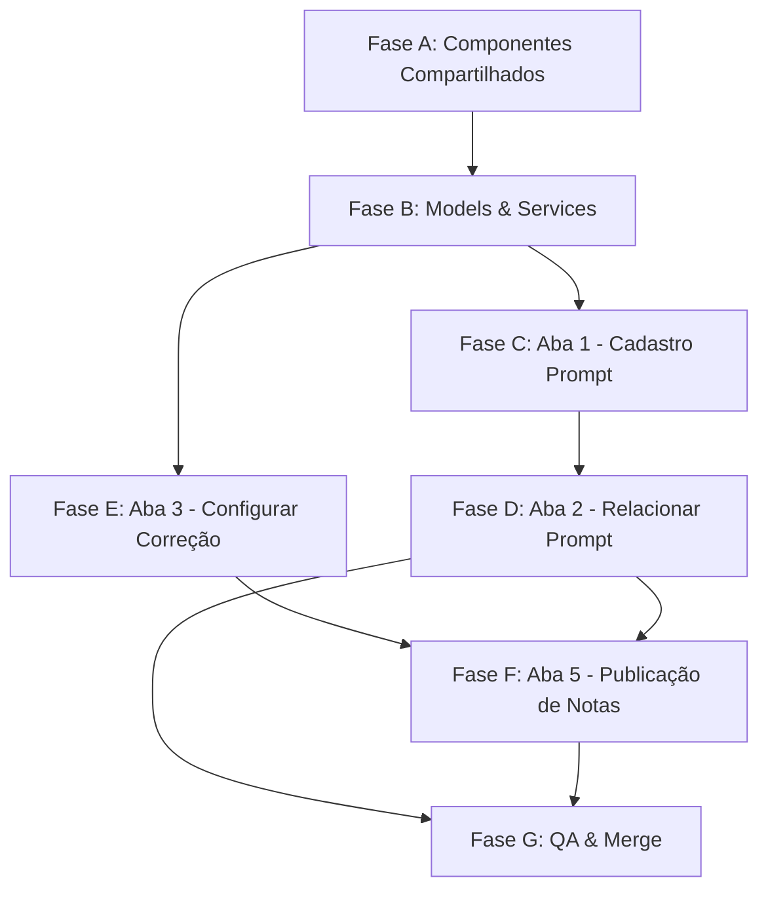

# Plano de Execução v3 — Atualizações das 4 Abas

> **Projeto**: vitru-angular (mesmo repositório)
> **Branch de trabalho**: `feature/v3-tab-enhancements`
> **Base**: código atual em `master` (Fases 1-8 v2 concluídas)
> **Referência**: `Requirements_v2/` (Business_Rules_v2, User_Stories_v2, Tech_Spec_Implementation_v2)

---

## Fase A — Componentes Compartilhados

### A.1 Criar `MultiSelectDropdownComponent`

**Diretório**: `components/shared/multi-select-dropdown/`

Componente reutilizável para filtros com dropdown, busca e seleção múltipla.

**Inputs/Outputs**:
```typescript
@Input() options: { value: any; label: string }[] = [];
@Input() label: string = '';
@Input() placeholder: string = 'Buscar...';
@Output() selectionChange = new EventEmitter<any[]>();
```

**Comportamento**:
- Campo de texto para busca por digitação (filtra as opções visíveis no dropdown)
- Ícone de seta (ri-arrow-down-s-line) para abrir/fechar dropdown
- Primeira opção: "Selecionar todas"
  - Se nem todas selecionadas → seleciona todas
  - Se todas selecionadas → desseleciona todas
- Checkbox a frente de cada opção
- Emite `selectionChange` com array de valores selecionados
- Click outside → fecha dropdown

### A.2 Criar `PromptDetailModalComponent`

**Diretório**: `components/shared/prompt-detail-modal/`

Modal centralizado para exibir/editar detalhes de um prompt.

**Inputs/Outputs**:
```typescript
@Input() prompt: Prompt | null = null;
@Input() isOpen: boolean = false;
@Input() allowEdit: boolean = false;       // false = campos bloqueados (padrão Aba 2)
@Output() close = new EventEmitter<void>();
@Output() saveObservations = new EventEmitter<{ id: string; observations: string }>();
@Output() savePrompt = new EventEmitter<{ id: string; title: string; body: string }>();
// savePrompt NÃO deve ser conectado na Aba 2 (campos readonly quando allowEdit = false)
```

**Visual**:
- Overlay escuro semi-transparente
- Card centralizado (max-width: 700px)
- Campos bloqueados: Título, Unidade, Tipo de Atividade, Corpo do Prompt → `readonly`, `background: #f0f0f0`, `cursor: not-allowed`
- Campo editável: Observações (textarea, max 10.000 chars) + botão "Salvar Comentário"
- Botão X para fechar

**Critério de aceite**: Componentes compilam, renderizam isoladamente, emitem eventos corretamente.

---

## Fase B — Atualizar Modelos & Services

### B.1 Atualizar `ia-corrections.models.ts`

Adicionar campos à interface `Prompt`:
```typescript
status: 'Ativo' | 'Inativo';    // default: 'Ativo'
observations: string;             // até 10.000 caracteres
```

Nova interface:
```typescript
export interface PublicationGlobalSettings {
  note: number | null;             // 0-100
  deadline: number | null;         // 0-99 (dias)
  autoPublicationEnabled: boolean; // default: false
}
```

### B.2 Atualizar `prompt.service.ts`

| Método novo | Descrição |
|---|---|
| `updatePromptStatus(id, status)` | Alterna Ativo/Inativo |
| `updatePromptObservations(id, observations)` | Salva apenas o campo observações |

Atualizar mock data: adicionar `status: 'Ativo'` e `observations: ''` a todos os prompts.

### B.3 Atualizar `prompt-linking.service.ts`

| Método novo | Descrição |
|---|---|
| `linkPromptToCourses(promptId, promptTitle, courseIds[], activityTypeName)` | Vinculação em lote |

### B.4 Atualizar `publication.service.ts`

| Método novo | Descrição |
|---|---|
| `getGlobalSettings()` | Retorna `PublicationGlobalSettings` |
| `saveGlobalSettings(note, deadline, enabled)` | Grava configurações globais |

**Critério de aceite**: Todos os services compilam, novos métodos retornam dados, mock data atualizado.

---

## Fase C — Aba 1: Cadastro Prompt (Aprimoramentos)

### C.1 Filtros na Lista de Prompts (painel esquerdo)

Acima da lista de prompts, adicionar:
```
┌─────────────────────────────┐
│  Unidade: [dropdown___▼]    │
│  Atividade: [dropdown___▼]  │
│  Situação: ☑ Ativo ☐ Inativo│
├─────────────────────────────┤
│  ● Prompt Corretor v1 ✓    │
│  ● Prompt Resenha v2       │
│  ● Prompt MAPA padrão      │
└─────────────────────────────┘
```

**Lógica**: `filteredPrompts = computed(() => { ... })` que aplica filtros de Unidade, Atividade e Situação.

### C.2 Badge Situação no Editor (painel direito)

Ao lado do título "Editar Prompt" / "Novo Prompt", exibir badge clicável:
- `Ativo` (badge-success) / `Inativo` (badge-secondary)
- Ao clicar: `promptService.updatePromptStatus(id, newStatus)`

### C.3 Campo Observações

Abaixo do textarea de corpo do prompt:
- Textarea `Observações` (10.000 chars, contador)
- Botão "Salvar Comentário" (invoca `promptService.updatePromptObservations(id, text)`)

**Critério de aceite**: Filtros funcionam cumulativamente, badge alterna status, observações salvam independentemente.

---

## Fase D — Aba 2: Relacionar Prompt (Reestruturação)

### D.1 Substituir layout de filtros

**Antes**: Dropdown de prompt + filtros de texto
**Depois**: 3 `MultiSelectDropdownComponent` em hierarquia:
1. Unidade de Negócio
2. Tipo de Atividade (cascata de Unidade)
3. Prompt (cascata de Unidade + Atividade)

### D.2 Área de vinculação em massa

```
┌──────────────────────────────────────────────────────────┐
│  Prompt: [dropdown hierárquico___▼]   [Vincular]         │
│  (aplica aos registros selecionados com checkbox)        │
└──────────────────────────────────────────────────────────┘
```

### D.3 Reestruturar tabela

Nova ordem de colunas:
| # | Coluna | Nota |
|---|---|---|
| 1 | ☐ Checkbox | Seleção para vinculação em massa |
| 2 | Unidade de Negócio | Texto |
| 3 | Tipo de Atividade | Texto |
| 4 | Cluster | Texto |
| 5 | Curso | Texto |
| 6 | Prompt Vinculado | **Clicável** → abre modal |

### D.4 Integrar `PromptDetailModalComponent`

Ao clicar no nome do prompt vinculado (coluna 6):
- Buscar prompt completo via `promptService.getPromptById(id)`
- Abrir `PromptDetailModalComponent` com dados preenchidos
- Hook `(saveObservations)` → `promptService.updatePromptObservations(id, text)`

### D.5 Padronizar paginação

Substituir o HTML de paginação atual pelo padrão da Auditoria:
- Seletor "Exibindo [10/25/50/100] por página"
- "Página X de Y"
- Botões "← Anterior" / "Próximo →" com ícones `ri-arrow-left-s-line` / `ri-arrow-right-s-line`
- Default: 25 itens por página

**Critério de aceite**: Filtros em cascata, vinculação em massa funciona, modal abre com campos bloqueados, comentários salvam, paginação padronizada.

---

## Fase E — Aba 3: Configurar Correção (Multi-Select Filters)

### E.1 Substituir filtros por `MultiSelectDropdownComponent`

**Antes**: Inputs de texto simples + dropdown de status
**Depois**: 6 instâncias do `MultiSelectDropdownComponent` em linha:
1. Unidade (popula com valores distintos da lista)
2. Cluster (cascata de Unidade)
3. Curso (cascata de Cluster)
4. Atividade (cascata de Curso)
5. Prompt (cascata de Atividade)
6. Status (opções fixas: Ativo, Inativo)

### E.2 Lógica de cascata hierárquica

```typescript
// Pseudocódigo
availableClusters = computed(() => {
  const data = this.configs();
  const selectedUnits = this.selectedUnits();
  if (selectedUnits.length === 0) return uniqueValues(data, 'clusterName');
  return uniqueValues(data.filter(c => selectedUnits.includes(c.businessUnitName)), 'clusterName');
});
// Repetir pattern para cada nível
```

### E.3 Padronizar paginação

Mesmo padrão da Auditoria (substitui o HTML de paginação atual).

**Critério de aceite**: Filtros multi-select funcionam com cascata, opções se atualizam ao selecionar filtro superior, "Selecionar todas" funciona, paginação padronizada.

---

## Fase F — Aba 5: Publicação de Notas (Layout Split + Global Settings)

### F.1 Reestruturar painel superior

**Antes**: Card full-width com regras
**Depois**: Layout 50/50

```
┌───────────────────────────────┬───────────────────────────────┐
│ Regras de Publicação          │ Configurações Globais         │
│ Automática                    │                               │
│                               │ Nota:    [___] (0-100)        │
│ • Notas ≥ valor → publicadas  │ Prazo:   [___] dias (0-99)    │
│   automaticamente             │                               │
│ • Notas < valor → retidas     │ Publicação Automática:        │
│   para curadoria manual       │ [Toggle ON/OFF]               │
│ • Valores ajustáveis a        │ "Aprovar liberação de nota    │
│   qualquer momento            │  automática"                  │
└───────────────────────────────┴───────────────────────────────┘
```

### F.2 Lógica do toggle

```typescript
canEnableAutoPublication = computed(() => {
  const note = this.globalNote();
  const deadline = this.globalDeadline();
  return note !== null && deadline !== null
    && Number.isInteger(note) && Number.isInteger(deadline)
    && note >= 0 && note <= 100
    && deadline >= 0 && deadline <= 99;
});

toggleAutoPublication() {
  const newState = !this.isAutoPublicationEnabled();
  this.service.saveGlobalSettings(
    this.globalNote()!, this.globalDeadline()!, newState
  ).subscribe(() => {
    this.isAutoPublicationEnabled.set(newState);
  });
}
```

### F.3 Substituir filtros por `MultiSelectDropdownComponent`

Mesmos filtros multi-select hierárquicos da Aba 3.

### F.4 Padronizar paginação

Mesmo padrão da Auditoria.

**Critério de aceite**: Layout 50/50, toggle desabilitado sem nota/prazo, ao ativar grava tudo, filtros multi-select com cascata, paginação padronizada.

---

## Fase G — QA, Commit & Merge

### G.1 Testes manuais via browser

| Fluxo | Validação |
|---|---|
| Aba 1 → Filtro Situação | Default "Ativo" marcado → só ativos visíveis |
| Aba 1 → Desmarcar todos | Nenhum prompt exibido |
| Aba 1 → Badge Inativo/Ativo | Status muda e persiste |
| Aba 1 → Observações | Digitar + "Salvar Comentário" → salva separado |
| Aba 1 → Filtros Unidade/Atividade | Filtram cumulativamente |
| Aba 2 → Filtros hierárquicos | Cascata Unidade → Atividade → Prompt |
| Aba 2 → Vinculação em massa | Checkbox + dropdown + Vincular |
| Aba 2 → Modal prompt | Campos bloqueados, observações editáveis |
| Aba 2 → Paginação | Padrão Auditoria (25 default) |
| Aba 3 → MultiSelect | Abrir, buscar, selecionar múltiplos, "Selecionar todas" |
| Aba 3 → Cascata | Selecionar Unidade → Cluster filtra |
| Aba 3 → Paginação | Padrão Auditoria (25 default) |
| Aba 4 → Regressão | Auditoria funciona sem alterações |
| Aba 5 → Layout 50/50 | Regras à esquerda, campos à direita |
| Aba 5 → Toggle desabilitado | Sem Nota/Prazo → toggle cinza |
| Aba 5 → Toggle habilitado | Com valores válidos → clicável |
| Aba 5 → Gravar | Ativar toggle → grava Nota + Prazo + status |
| Aba 5 → Filtros multi-select | Mesmos da Aba 3 |
| Aba 5 → Paginação | Padrão Auditoria (25 default) |

### G.2 Commit e merge

```bash
git checkout feature/v3-tab-enhancements
git add .
git commit -m "feat(v3-tab-enhancements): multi-select filters, prompt status/observations, bulk linking, publication split layout"
git checkout master
git merge feature/v3-tab-enhancements
git push origin master
```

> **Nota**: A branch `feature/v3-tab-enhancements` já deve existir (criada na etapa de planejamento). Use `git checkout` ao invés de `git checkout -b` se ela já existir localmente.

---

## Resumo de Arquivos

### Novos
| Arquivo | Fase |
|---|---|
| `components/shared/multi-select-dropdown/*` | A |
| `components/shared/prompt-detail-modal/*` | A |

### Modificados
| Arquivo | Fase |
|---|---|
| `models/ia-corrections.models.ts` | B |
| `services/prompt.service.ts` | B |
| `services/prompt-linking.service.ts` | B |
| `services/publication.service.ts` | B |
| `components/prompt-registration-tab/*` | C |
| `components/prompt-linking-tab/*` | D |
| `components/correction-config-tab/*` | E |
| `components/publication-tab/*` | F |

### Mantidos (sem alteração)
| Arquivo | Fase |
|---|---|
| `components/audit-tab/*` | — (referência de paginação) |
| `services/ia-config.service.ts` | — |
| `services/correction-config.service.ts` | — |
| `guards/unsaved-changes.guard.ts` | — |
| `ia-corrections-page.component.*` | — |

---

## Ordem de Execução



> **Nota**: Fases C e E podem rodar em paralelo (ambas dependem apenas de B). Fase D depende de C (precisa do modal e prompt atualizado). Fase F depende de **E e D** (reutiliza filtros multi-select da Fase E e dados de vínculo Prompt-Curso da Fase D para exibir a coluna Prompt na tabela de publicação).
